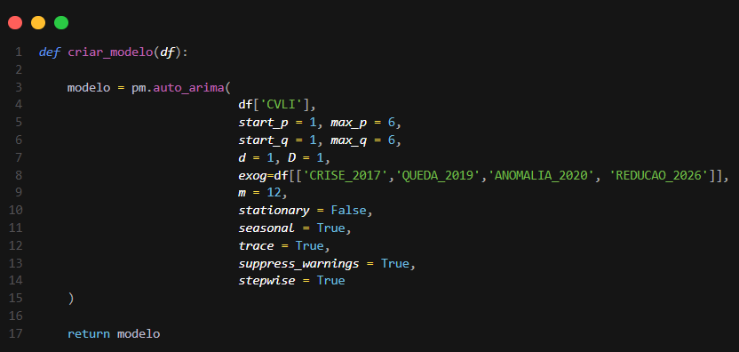
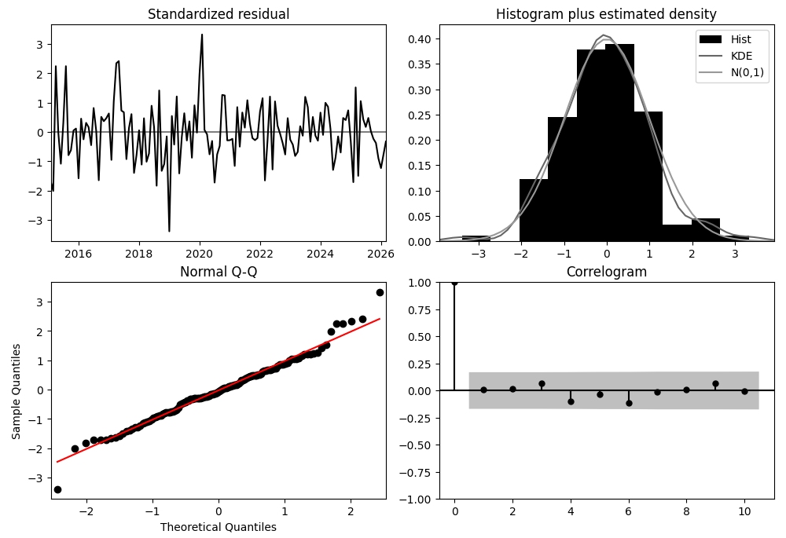
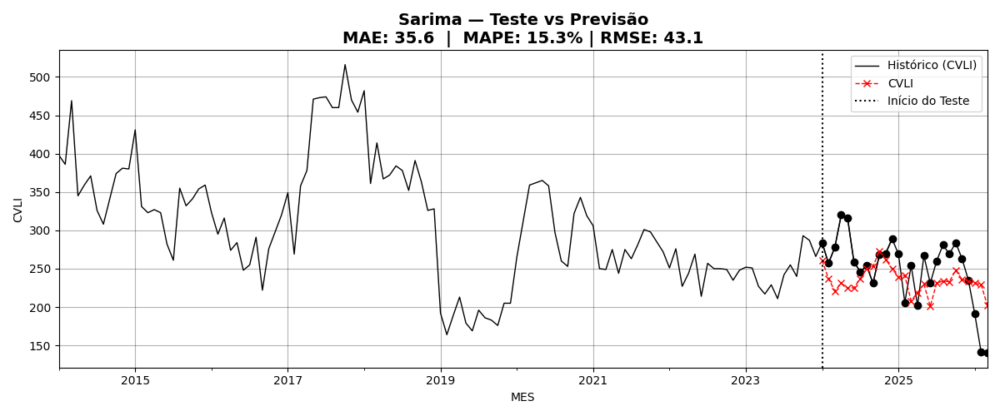
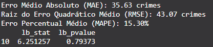
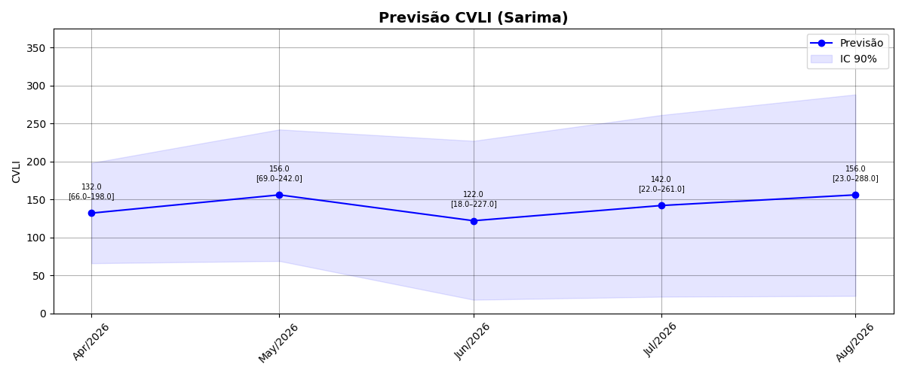
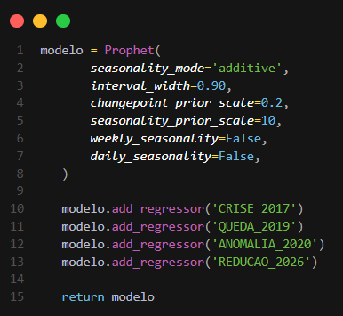
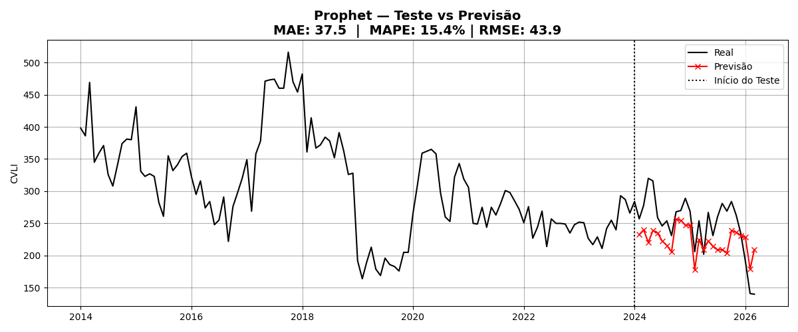
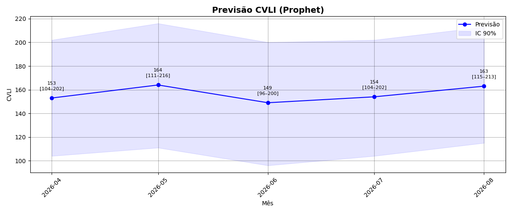

# Um Estudo Preditivo e Descritivo Sobre os CVLI Ocorridos no Estado do Ceará (2014 - 2025)

## 📄 Resumo
    
- **Problema**: As altas taxas de criminalidade são um dos problemas mais graves enfrentados pelo estado do Ceará nos últimos anos. Partindo desse ponto, como criar um estudo que evidencie o comportamento dos números de homicídios no estado do Ceará, com a finalidade de obter informações relevantes acerca dessa problemática?

- **Solução**: Realizar um estudo descritivo sobre os dados acumulados de CVLI (Crimes Violentos Letais e Intencionais) entre os anos de 2014 e 2025, e implementar algoritmos preditivos com o intuito de obter possíveis cenários para os valores acumulados de CVLI no ano de 2026 no Ceará.

- **Impacto:** No ano de 2025, o estado do Ceará apresentou um total de 3.178 homicídios. Partindo disso, o estudo identificou uma tendência de queda no número de CVLI observados no estado para o ano de 2026. Entretanto, apesar da tendência de redução, os dados ainda são preocupantes, o que mostra a necessidade de políticas públicas direcionadas para o combate ao crime organizado e a redução das taxas de homicídios em todas as regiões do estado.


## 📋 Introdução e Contextualização

- **Objetivo:** O objetivo principal deste estudo é extrair insights estratégicos sobre os índices de CVLI no estado do Ceará. A análise identifica padrões, como os meses com maior incidência de ocorrências, visando fornecer informações fundamentais sobre o comportamento desses crimes no estado.

- **Metodologia:** Na análise preditiva, as ferramentas utilizadas envolveram a linguagem de programação Python, empregada tanto na análise exploratória quanto na construção dos modelos. Para a modelagem de séries temporais, foram implementados três métodos: SARIMA, Exponential Smoothing e Prophet. Já para a análise descritiva, utilizou-se o Tableau na criação e visualização do dashboard, e o Python para a extração e o tratamento dos dados.

## 🎲 Coleta de Dados

- **Fonte:** Os dados foram obtidos por meio do portal da Secretaria de Segurança Pública e Defesa Social (SSPDS) do Estado do Ceará e organizados em um arquivo no formato .csv. Devido à integridade das informações, não foi necessária a aplicação de técnicas para tratamento de valores nulos ou dados faltantes. O conjunto de dados compreende 144 registros mensais, cobrindo o intervalo de 12 anos (2014 a 2025), com a distribuição das ocorrências por gênero (Feminino e Masculino). Para a elaboração das previsões, foram utilizadas as colunas de séries históricas e a variável correspondente ao somatório total de CVLI ocorridas no respectivo mês.

## 📁 Estrutura do Projeto

```

analise_cvli_ceara/
    ├── dados/                                       # 🎲 Dados utilizados no estudo           
    ├── dashboard/                                   # 🔍 style Dashboard                                         
    ├── img/                                         # 📁 Diretórios com as imagens usadas no README
    ├── outputs/                                     # 🎲 Previsões geradas pelos modelos
    ├── src/                                         # 🔭 Modelos Preditivos Implementados 
    │    ├── exponential_smoothing/              
    │    ├── sarima/                                
    │    └── prophet/                                                                     
    ├── requirements.txt                             # 💻 Bibliotecas usadas no projeto 
    ├── .gitignore
    ├── index.html                                   # 📊 Análise Descritiva (2014 - 2025)
    ├── main.py                                      # 🎯 Função principal 
    └── README.md                                    # 📋 Relatório final do Projeto 

```


## 🔭  Análise Exploratório de Dados

### Distribuição dos Homicidios Ceará (2014 - 2025) 

<div align="center">
  
</div>

A base de dados compreende 144 observações mensais (2014 a 2025). Os dados de CVLI estão distribuídas pelo Mes, pela variável CVLI que represnta a soma total de CVLI (F + M) observado e pelas variáveis M (Masculino) e F (Feminino). A série histórica é composta, majoritariamente, por vítimas do sexo masculino; nota-se que o comportamento da curva de CVLI é quase integralmente ditado pela variação dos CVLI ocorrodos com vítimas do sexo masculino, dada a baixa representatividade estatística das ocorrências crimes contra pessoas do sexo feminino.


### Decomposição da Série Temporal 

<div align="center">
  
</div>

*Interpretação dos Gráficos Obtidos*

**Distribuição**
  
- Variação: Os dados de CVLI iniciam com o patamar superior aos 400 CVLIs no ano de 2014, seguido de algumas oscilações. Posteriormente, observar-se uma redução drástica entre os meses finais de 2018 e iniciais de 2019. O ano  2017 apresentou o maior valor de CVLI observado em um mês, além de ser o ano com maior valor acumulado de homicídios no estado do Ceará. Por outro lado, o ano de 2019 apresentou o menor valor  observado na série, com meses apresentando dados inferiores a 200 CVLIs.

- Volatilidade: Observa-se fortes oscilações, com picos muitos acentuados e reduções drásticas em alguns períodos da série. Essas flutuações podem ter sido influenciadas por eventos externos como crises na segurança pública e conflitos entre facções.  

**Trend (Tendência)**

- Queda: A série inicia com valor de 400 CVLI no ano de 2014, seguida de uma queda suave até atingir seu menor valor no mês 35 (Fim do ano de 2015). Posteriormente, houve um aumento expressivo atingindo o seu pico no mês 45 (ano de 2017) o ano mais violento observado em todo o intervalo. Nos anos seguintes houve queda acentuada nos números de CVLI até o mês 65 (Ano de 2019). 

- Estabilidade: Após o mês 80 (ano de 2020), a tendencia dos dados é queda suave e constante, sugerindo que políticas públicas de segurança ou condições externas (Fim de conflitos entre facções criminos por influência em território de tráfico) podem ter afetado os números de CVLI. Por fim, nos últimos 4 anos de amostra observa-se uma certa estabilidade nos dados (Com uma pequena variabilidade dos dados).

**Seasonal (Sazonal):**

- Observa-se uma padrão sazonal claro nos homicídios do estado do Ceará ao longo dos anos. O primeiro período de aumento ocorre entre os meses de fevereiro e março, com expressivo aumento dos assassinatos, possivelmente influenciado por festividades como carnaval e o período de férias. O maior pico sazonal é observado entre os meses de Julho e Agosto, coincidindo com férias do meio do ano, período em que se registra as maiores altas nos crimes no estado. Em seguida, observa-se um período de estabilidade entre os meses de agosto e setembro, com poucas flutuações nos números. Por fim, após essa estabilidade há uma queda acentuada e contínua, que culmina em uma redução considerável atingindo seu ponto mais baixo no mês de dezembro

**Resid (Resíduo/Irregular/Restante):**

- Aleatoriedade: a maioria dos pontos concentra-se em torno de zero, sugerindo que o modelo de decomposição capturou bem os padrões (tendência e sazonalidade) da série. Os resíduos aparentam ser aleatórios, sem viés evidente.  

- Interpretação: Outliers (Pontos fora da curva) observa um outliers considerável no mês 72 (ano de 2020). Neste ano houve uma crise policial, onde delegacias foram fechadas e parte da força policial do estado não estava nas ruas, o que impactou de forma significativa esses valores. Eventos extraordinários como esse não são capturados pelos componentes de tendência e sazonalidade.

## 📚 Bibliotecas

- statsmodels (v0.14.6)
- scikit-learn (v1.8.0)
- matplotlib (v3.7.1)
- pandas (v3.0.2)
- pmdarima (v2.1.1)
- numpy (v1.26.4)
- joblib (v1.5.3)
- Ambiente de Desenvolvimento (Visual Studio Code)
- Python Linguagem de Programação 

## 📈 Modelo SARIMAX

Antes de aplicar o modelo SARIMAX é necessário verificar a estacionariedade da série temporal. Foi aplicado o teste Augmented Dickey-Fuller (ADF) na Série com intuito de verificar a série. Observpu-se um p-valor de aproximadamente 0.068, indicando que a série original é não-estacionária, com um nível de significância de 5%. Para ajustar esse comportamento, aplicou-se a técnica de diferenciação para remover a tendência modificando o d = 1 e D = 1 nos parêmetros do próprio modelo auto-arima. 


<div align="center">
  
</div>

### Auto-Arima 

<div align="center">
  
</div>

Algoritmo implementado para testar diferentes combinações de parâmetros e selecionar o melhor ajuste com base em critérios estatísticos. O parâmetro exog recebeu as variáveis dummy utilizadas para o modelo identificar eventos atípicos ocorridos ao longo da série. Um exemplo é a variável ANOMALIA_2020, que representa o aumento significativo de homicídios observado durante a crise policial daquele ano.

Modelo escolhido: 

    ARIMA(1, 1, 0)(2, 1, 0)[12]

### Diagnosticos do Modelo SARIMAX

<div align="center">
  
</div>

## Após implementar tratamento 
<div align="center">
  
</div>

- **Standardized residual (Resíduo padronizado)**: Antes: Havia um outlier extremo (erro > 6) no índice 60 (janeiro de 2019), causado por crises de segurança pública.

- **Histogram(Histograma)**: Histograma (Histogram plus estimated density): * A curva de erro real (KDE) ajustou-se quase perfeitamente à curva de normalidade, comprovando que os erros do modelo são equilibrados. 

- **Theoretical Quantiles (Normal Q-Q)**: Os pontos alinharam-se sobre a reta vermelha de 45°, o que valida estatisticamente o pressuposto de normalidade dos resíduos e prova que o modelo lida bem com os dados atuais. 

- **Correlogram (ACF - Função de Autocorrelação)**: Nenhum valor ultrapassou a faixa cinza de significância. Isso prova a ausência de autocorrelação, ou seja, o modelo capturou 100% da dependência temporal e o que sobrou é apenas ruído aleatório (ruído branco).


### Treinamento 

Foi realzado uma divisão da base de dados para treinamento e teste como evidência a imagem abaixo. 

<div align="center">
  
</div>

### Validação do Modelo (Previsões 2024 - 2025)


<div align="center">
  
</div>

### Metricas do SARIMAX (MAE | MAPE | RMSE)

<div align="center">
  
</div>

Valores obtidos ao inserir os dados dos meses de jan - mar de 2026. 
Nesse primeiro trimestre o estado do Ceará apresentou o menor número para primeiro trimestre da série histórico o que impactou o resultado final obtido pelo modelo. 

### Interpretação das Metricas do Modelo 

- **MAE (Mean Absolute Error)**: O MAE observado foi de 35.6. Isso indica que o modelo erra, em média, 36 ocorrências de CVLI por período. Dado a volatilidade dos dados é um desempenho considerável bom. 

- **RMSE (Root Mean Square Error)**: O valor do RMSE (43.07) apresentou um valor reletivamente alto comparado ao MAE. Essa diferença entre as duas métricas sugere que o modelo teve um maior dificuldade, o que pode ser visto pela a inserção de novos dados do ano de 2026 que impactaram nas metricas finais do modelo.

- **MAPE**: Com um MAPE de 15.3%, o modelo demonstra uma boa performance preditiva. Isso indica previsões sólidas e confiáveis para séries temporais de fenômenos sociais . 

### Validação Estatística do Modelo (Ljung-Box)

- **p_valor**: como o valor de p-valor (0.79373
) é superior a 0.05, então  a hipotése nula deve ser considerada (Os resíduos são ruídos brancos). Onde toda a informação útil foi extraida da base de dados e convertida em previsão. 

### Previsão para (abril - Agosto de 2026) 

O modelo realizou a previsão com intervalo de confiança de 95% 


<div align="center">
  
</div>

Quanto mais distante são as previsões maior é o nível de incerteza. Por conta disso existe o aumento no intervalo de confiança observado nas previsões.

## 📈 Exponential Smoothing

### Modelo Exponential Smoothing  

<div align="center">
  
</div>


### Treinamento 

<div align="center">
  
</div>

### Validação do Modelo (Previsões 2024 - 2025)

<div align="center">
  
</div>


### Metricas do  Exponential Smoothing   (MAE | MAPE | RMSE)


- **MAE (Mean Absolute Error)**: O MAE observado foi de 30.5. Isso indica que o modelo erra, em média, ~31 ocorrências de CVLI por período.

- **RMSE (Root Mean Square Error)**: O valor do RMSE (38.1) apresentou-se próximo ao MAE. Essa baixa diferença entre as duas métricas sugere que o modelo é consistente e não está cometendo erros de grande magnitude.

- **MAPE**: Com um MAPE de 13.6%, o modelo demonstra uma boa performance preditiva. Isso indica previsões sólidas e confiáveis para séries temporais de fenômenos sociais. 

### Validação Estatística do Modelo 

<div align="center">
  
</div>

- **p_valor**: como o valor de p-valor (0.471511) é superior a 0.05, então  a hipotése nula deve ser considerada (Os resíduos são ruídos brancos). Toda a informação útil foi extraida da base de dados e convertida em previsão. 


### Previsão para (abril - Agosto de 2026) 

O modelo realizou a previsão com intervalo de confiança de 90% 

<div align="center">
  
</div>

Quanto mais distante são as previsões maior é o nível de incerteza. Por conta disso existe o aumento no intervalo de confiança observado nas previsões.


## 📈 Prophet

### Modelo Prophet 

Modelo implementado no prophet 
<div align="center">
  
</div>

 As Variáveis dummy inseridas para diferenciar eventos incomuns na série, como por exemoplo a crise de 2017 ocorrida na segurança pública do estado do Ceará (Ano mais violento da série).

### Treinamento 

Divisão treino e teste para validação do modelo implementado 

<div align="center">
  
</div>

### Validação do Modelo (Previsões 2024 - 2025)

<div align="center">
  
</div>

### Previsão com intervalo de Confiança 

Previsão do Modelo Prophet com intervalo de confiança de 90% 
<div align="center">
  
</div>


## 📊 Resultados


Resultados obtidos na implementação dos modelos (Exponential Smoothing, Sarima e Prophet)

| Modelo                |  MAPE  |  MAE  | RMSE | LB_STAT(Lag 10) | LB_pVALUE  |
|-----------------------|--------|-------|-----|-----------------|------------|
| Sarimax                | 15.3% | 35.6| 43.1 |  6.251257 |0.79373 |
| Exponential Smoothing | 13.6% | 30.5| 38.1 |  9.652282 |0.471511 | 
|prophet |15.4% |37.5|43.90|~|~|


✅ **Exponential Smoothing (Vencedor)**: Alcançou o melhor desempenho geral, registrando o menor MAPE (13,6%), além dos menores erros absolutos (MAE de 30,5 e RMSE de 38,1). Suas previsões foram as que mais se aproximaram da realidade observada no início de 2026.

**SARIMAX:** Apresentou uma performance competitiva com um MAPE de 15,3% (MAE: 35,6 / RMSE: 43,1). O teste de Ljung-Box confirmou a independência dos resíduos (p-valor: 0,793), validando o ajuste estatístico.

**Prophet:** Obteve o maior erro médio da validação, com um MAPE de 15,4% (MAE: 37,5 / RMSE: 43,90), mostrando-se ligeiramente menos responsivo à quebra estrutural do período recente.


## ▶️ Como Reproduzir o Programa 
```

⏩ Executar a função Main()
      | 
      ├── executa exponential smoothing 1️⃣ 
      | 
      ├── executa sarima 2️⃣ 
      |
      ├── executa prophet 3️⃣ 
      | 
      └── executa dashborad /página html 4️⃣ 
    
```
